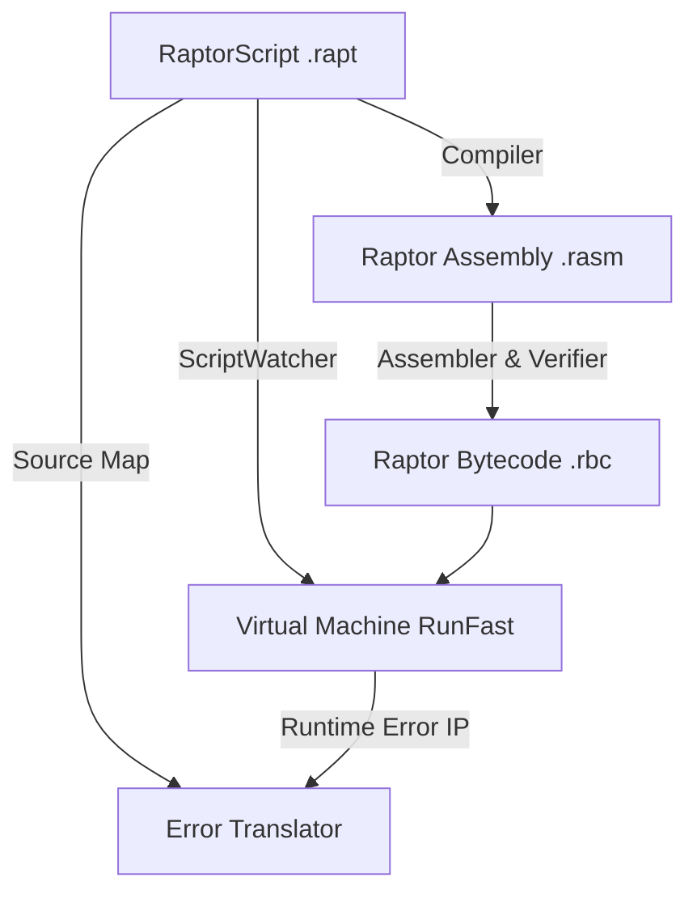

<p align="center">
  
</p>

<h1 align="center">Raptor VM & Scripting Language</h1>

<p align="center">
  A high-throughput, zero-allocation, register-based virtual machine and scripting pipeline built for .NET 10.0 game engines and systems.
</p>

<p align="center">
  
  
  
  
</p>

## Overview

Raptor is a register-based virtual machine and scripting engine for .NET 10.0, designed for game engine hot loops. It includes RaptorScript (a high-level language), an optimizing compiler with source maps, a CLI toolchain, and a C# VM interpreter.

To avoid GC allocations during interpretation, registers are restricted to 64-bit doubles and pinned via `GCHandle` (256 virtual registers accessed through raw pointers, bypassing bounds checks and GC pressure). This architecture yields execution throughput between 360 and 660+ MIPS on consumer hardware.

## Installation

### .NET (NuGet)
Install the `Raptor.VM` package via .NET CLI:
```bash
dotnet add package Raptor.VM
```

### Unity (Package Manager)
Open Unity's Package Manager (`Window -> Package Manager`), select `Add package from git URL...`, and enter:
```text
https://github.com/InfiniteFightingGhost/Raptor.git?path=/Raptor
```

## Quickstart

Embed Raptor in C# by registering FFI modules and compiling scripts:

```csharp
using Raptor;
using Raptor.StdLib;

// 1. Initialize engine and register standard FFI modules
using var engine = new ScriptEngine();
var table = new FFIHostTable();
table.RegisterModule(typeof(RaptorMath));
table.RegisterModule(typeof(RaptorPeripherals));
engine.RegisterHostTable(table);

// 2. Compile high-level RaptorScript into an optimized VM chunk
VMChunk chunk = engine.CompileRaptorScript(@"
    var radius = 5.0;
    var area = math.pi() * math.pow(radius, 2.0);
    peri.print(area);
");

// 3. Execute with zero GC allocations
ExecutionResult result = engine.Execute(chunk);
```

## Scripting Pipeline

Raptor includes a compiler, CLI toolchain, source-mapping error translator, and VM interpreter:



### 1. High-Level RaptorScript (`.rapt`)
RaptorScript syntax:
```javascript
// script.rapt
var result = 8 | 4 ^ 2 & 10 == 5 << 1 && 3 || 9;
peri.print(result);

for(var i = 0; i < 10; i++) {
    peri.print(i);
}
```

#### Compiled Output (Raptor Assembly - `.rasm`)
Conditional branch translation example:

```javascript
// RaptorScript (.rapt)
var x = 10;
if (x < 20) {
    peri.print(x);
}
```

Translates directly to:

```assembly
; Raptor Assembly (.rasm)
LOADC r1 10.0            ; Load x (10) into register r1
LT 1 r1 20.0             ; Compare r1 < 20.0 (expected true, skip JUMP if met)
JUMP logic_end           ; Jump past body if comparison is false
CALL peri.print() r1     ; Call FFI print with register r1
logic_end:               ; End of branch
HALT                     ; Stop VM execution
```

### 2. Live Reloading (`ScriptWatcher`)
The thread-safe `ScriptWatcher` monitors script files on disk and automatically recompiles and swaps the execution `VMChunk` on the fly, updating state without halting the execution thread.

### 3. Source Mapping & Diagnostics
When a runtime exception occurs, Raptor uses compiler-generated source maps to translate the execution Instruction Pointer (IP) offset back to the exact line number and source snippet of the original high-level `.rapt` file.

### 4. Auto-Generated Editor Autocomplete
The FFI system automatically generates autocomplete JSON files (`-api.json`) listing all registered host methods, descriptions, signatures, and constants, enabling integration with editor extensions and IDEs.

## Architectural Comparison

| Feature / Metric | MoonSharp | NLua | LuaJIT (Interpreter) | Raptor VM |
| :--- | :--- | :--- | :--- | :--- |
| Language | Lua 5.2 | Lua 5.4 | Lua 5.1 | RaptorScript / Assembly |
| Runtime Environment | Pure C# (Managed) | C# Bindings + Native C | Native C / Assembly | Pure C# (Unsafe/Managed) |
| Instruction Architecture | Stack-based VM | Stack-based VM | Register-based VM | Register-based VM |
| Execution Performance | ~10–15 MIPS | ~50–80 MIPS | ~100–150 MIPS (No JIT) | 360–660+ MIPS |
| Garbage Collector (GC) pressure | High (allocates per-instruction) | Low-to-Medium (native heap) | None (native heap) | Zero Managed GC Allocations |
| FFI Call Overhead | High (reflection/boxing) | Medium (~50–150 ns marshalling) | Low (~10-20 ns call cost) | Low (< 5 ns direct call cost) |
| AOT / IL2CPP Compatibility | Excellent (Refsafe JIT limits) | Complex (requires native libs) | Broken on iOS/Consoles | Full (.NET native support) |
| Memory Locality | Managed heap objects | Medium (C-structs) | High (C-structs) | High (GCHandle-pinned registers) |

> [!NOTE]
> Unlike general-purpose Lua runtimes that manage dynamic table objects and metatables on the heap, Raptor restricts registers to 64-bit doubles to achieve zero-GC execution in hot game loops. With 256 virtual registers, instruction dispatch overhead is reduced.

## Performance & Benchmarks

Captured on AMD Ryzen 7 (Zen 4 Architecture), .NET 10.0.1, Arch Linux.

### High-Frequency Gameplay Workloads

| Benchmark | Timing (μs) | Workload Details |
| :--- | :--- | :--- |
| ECS Entity Update | 20.79 μs | Updates positions (`px`, `py`) using velocities and delta time for 1,000 entities (20.79 ns per entity). |
| BFS Grid Pathfinding | 13.25 μs | Executes a wavefront path search on a 16x16 grid to locate target node. |
| Dialogue Condition Tree | 82.90 μs | Evaluates nested quest state and gold balance conditions 10,000 times (8.29 ns per evaluation). |
| Inventory Rarity Sort | 49.88 μs | Selection Sort sorting 100 inventory loot items by rarity. |

### Instruction Latency
Opcode execution latencies inside the interpreter loop:

| Instruction | Latency (ns) | Execution Notes |
| :--- | :--- | :--- |
| LOADC | 0.89 ns | Load constant into register |
| SUB | 0.92 ns | Floating-point subtraction |
| MOVE | 1.10 ns | Register-to-register copy |
| MUL | 1.27 ns | Floating-point multiplication |
| DIV | 1.45 ns | Floating-point division |
| SQRT | 1.50 ns | Hardware-accelerated square root |
| ADD | 1.52 ns | Floating-point addition |
| JUMP | 1.53 ns | Unconditional PC offset branch |
| RAND | 2.43 ns | Custom bit-shifted Xorshift32 PRNG |
| FISR | 5.68 ns | Double-precision Fast Inverse Square Root |

## Architectural Features

### Pinned Register File
The 256-register file is heap-allocated and pinned via `GCHandle` at VM initialization, giving the interpreter a stable raw pointer for the entire VM lifetime:
```csharp
private readonly double[] _registers = new double[256];
// ...
_regHandle = GCHandle.Alloc(_registers, GCHandleType.Pinned);
_regPtr = (double*)_regHandle.AddrOfPinnedObject();
```
This avoids per-frame GC allocations and bypasses array bounds checks in the interpreter loop.

### Fused Loop Control (`FOR` Super-Instruction)
Compiles loop increments, comparisons, and branches into a single two-word `FOR` super-instruction, reducing interpreter loop dispatch overhead by 50%.

### GCHandle Pinning
Bypasses array boundary checks in the interpreter loop by pinning managed bytecode, constants, heap, and register arrays via `GCHandle.Alloc(..., Pinned)` at initialization for direct pointer indexing throughout execution.

## Embedded Raytracer

A double-precision 3D raytracer implemented in assembly, rendering a camera viewport orbiting a reflective sphere in 8.2 μs per frame.


## CLI Reference

Raptor includes a CLI toolchain (`Raptor.Cli`) for compiling and running scripts.

### Create a Script
Creates a new `.rapt` script file with a starter template:
```bash
dotnet run -c Release --project Raptor.Cli -- new script.rapt
```
Options:
- `-f | --force`: Overwrites target `.rapt` file if it exists.

### Run a Script
Compiles, verifies, and runs a RaptorScript (`.rapt`) file:
```bash
dotnet run -c Release --project Raptor.Cli -- run script.rapt
```
Options:
- `--no-build`: Runs a pre-compiled `.rbc` file directly from `build/`.
- `-a | --omit-assembly`: Omits generating the intermediate `.rasm` assembly file.

### Build a Script
Compiles code to assembly (`.rasm`) and binary bytecode (`.rbc`), generating `-api.json` metadata:
```bash
dotnet run -c Release --project Raptor.Cli -- build script.rapt
```
Options:
- `-a | --omit-assembly`: Omits intermediate `.rasm` file.
- `-p | --print-ast`: Prints compiled AST to console.

### Browse Documentation
Opens documentation reference in browser:
```bash
dotnet run -c Release --project Raptor.Cli -- docs
```

## Documentation & Project Structure

Documentation and example workloads:

### Core Architecture & Specifications
- [Core Architecture & Calling Conventions](docs/architecture.md): Calling conventions, sliding windows, and instruction bit-packing.
- [Instruction Set Architecture (ISA) Reference](docs/isa.md): Complete instruction table detailing operational codes and syntax.
- [Assembler Pipeline & Constant Pool](docs/assembler.md): Constant pool deduplication and two-pass assembly process.
- [Heap Memory Management & Custom Allocator](docs/memory.md): Free list allocator details, neighbor coalescing, and safety bounds.
- [Performance & Hardware-Level Optimizations](docs/optimizations.md): Pointer pinning, cache locality, and register unions.
- [Performance & Benchmark Baselines](docs/benchmarks.md): Baseline history and regression testing instructions.

### Example Workloads
- [Recursive & Linear Fibonacci](examples/fibonacci.md): Analysis of recursion depth limits and flat arithmetic loops.
- [Monte Carlo Pi Approximation](examples/monte_carlo.md): 4x loop unrolling optimization producing a 25.6% speedup.
- [Perceptron Machine Learning Model](examples/perceptron.md): Model training illustrating weight updates and FFI calling.
- [3D Raytracer Visual Render](examples/raytracer.md): Raytracer camera parameters, mathematical formulas, and PPM output formatting.

### Directory Structure
```text
Raptor/
├── .github/                  # CI/CD workflows, release automation, and issue templates
├── docs/                     # Architectural & specification documents (ISA, memory, pipeline)
├── examples/                 # Example workloads (raytracer, fibonacci, monte carlo, perceptron)
├── Raptor/                   # Core VM, Compiler, and FFI engine (Unity & .NET compatible)
│   ├── Attributes/           # FFI metadata attributes ([RaptorModule], [RaptorMethod], etc.)
│   ├── Compiler/             # Lexer, Parser, AST nodes, and RaptorScript bytecode compiler
│   ├── StdLib/               # Built-in native FFI modules (RaptorMath, RaptorPeripherals)
│   ├── ScriptEngine.cs       # High-level host embedding entry point
│   ├── VirtualMachine.cs     # Ultra-fast hot interpreter dispatch loop & opcode logic
│   ├── BytecodeVerifier.cs   # Bytecode safety validator & stack/register boundary verifier
│   ├── FFIHostTable.cs       # High-speed method reflection & zero-overhead invocation host table
│   ├── Assembler.cs          # Two-pass assembly parser, instruction encoder & constant pool
│   ├── Disassembler.cs       # Bytecode disassembler & instruction decoder
│   ├── ScriptWatcher.cs      # Thread-safe filesystem hot-reloader
│   ├── RaptorBinary.cs       # .rbc binary serialization and header verification engine
│   ├── VMState.cs            # CPU cache-friendly VM execution state struct
│   └── package.json          # Unity Package Manager (UPM) manifest & asmdef integration
├── Raptor.Cli/               # Spectre.Console CLI toolchain
│   ├── BuildCommand.cs       # Compiles .rapt -> .rasm / .rbc & exports editor API metadata
│   ├── RunCommand.cs         # Compiles & executes scripts directly from terminal
│   └── DocsCommand.cs        # Opens documentation reference in browser
├── Raptor.Benchmarks/        # BenchmarkDotNet performance benchmark suite
└── Raptor.Tests/             # Unit and integration test suites
    ├── VMIntegrationTests.cs # Full end-to-end VM script execution tests
    ├── BytecodeVerifierTests.cs # Safety, invalid opcode & boundary verification tests
    └── FfiReflectionTests.cs # FFI method registration & call overhead tests
```

## Built-In Standard Library

Raptor includes core FFI modules exposed natively to RaptorScript:
- `math`: In `RaptorMath.cs` (contains `Sin`, `Cos`, `Tan`, `Pow`, `Sqrt`, `Min`, `Max`, `Abs`, `Floor`, `Ceiling`, `Atan2`, `Clamp`, `Pi`).
- `peri`: In `RaptorPeripherals.cs` (contains `Print`).

Modules register via reflection using custom attributes (`[RaptorModule]`, `[RaptorMethod]`, `[RaptorDescription]`, `[RaptorParam]`, `[RaptorPure]`).

## Roadmap

- [ ] **Gas Budgeting & Instruction Limits**: Instruction counter guard to bound script execution time on hot threads.
- [x] **Rust-Style Diagnostic Errors**: Source spans with inline code snippets and fix hints.
- [ ] **Standard Library Expansion**: Native 2D/3D vector math structs (`vec2`, `vec3`), string operations, and fixed-capacity lists in the FFI host table.
- [ ] **RaptorPure Handling**: Sandboxed execution preventing host side-effects or external mutations.
- [ ] **IDE Language Server Support**: LSP server for real-time diagnostics, `-api.json` auto-complete, and syntax highlighting.

## Community & Support

- Ask questions and share ideas on [GitHub Discussions](https://github.com/InfiniteFightingGhost/Raptor/discussions).
- Report bugs or request features using [Issue Templates](https://github.com/InfiniteFightingGhost/Raptor/issues/new/choose).
- Report security issues via the [Security Policy](SECURITY.md).

## License
Raptor is released under the [MIT License](LICENSE).
