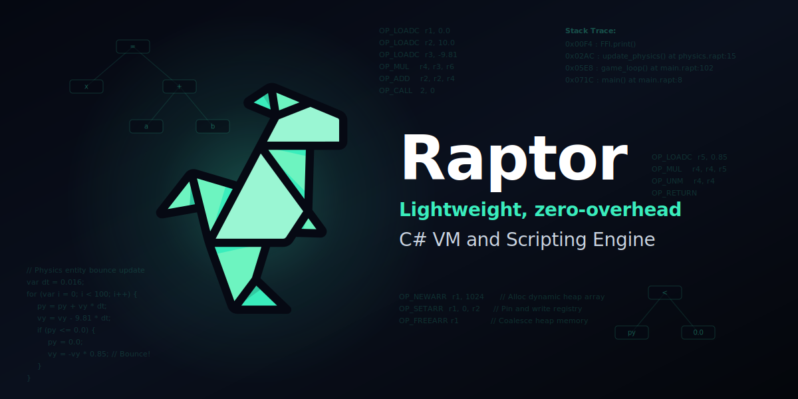
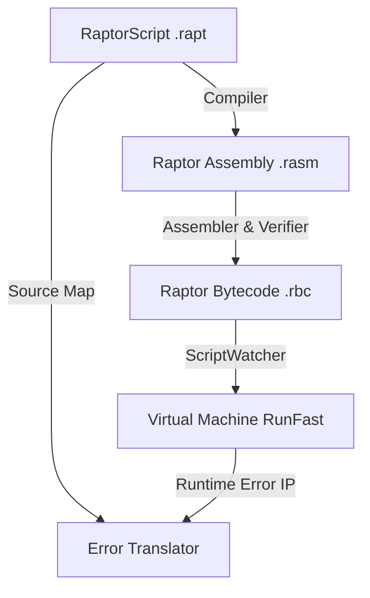

<p align="center">
  
</p>


<h1 align="center">Raptor VM & Scripting Language</h1>

<p align="center">
  <strong>A screamingly fast, zero-allocation, register-based virtual machine and high-level scripting pipeline built for .NET 10.0 game engines and systems.</strong>
</p>

<p align="center">
  
  
  
  
</p>

---

## What is Raptor?

**Raptor** is a complete, high-performance scripting pipeline consisting of **RaptorScript** (a high-level, JS/C#-like programming language), an optimizing compiler with source map debugging, a command-line toolchain (CLI), and an ultra-fast register-based virtual machine interpreter written in C# targeting **.NET 10.0**.

By combining raw pointer arithmetic, stack-allocated registers, and live program reloading, Raptor runs scripts at **360 to 660+ MIPS** on standard consumer hardware. It is built specifically for **game engine scripting** where high execution speeds, low FFI latency, and zero garbage collection stutter are non-negotiable.

---

## The Raptor Scripting Pipeline

Raptor goes beyond simple bytecode execution by providing a modern scripting toolchain:



### 1. High-Level RaptorScript Language (`.rapt`)
Write scripts using a clean, standard syntax supporting variables, loops, branches, nested math, and bitwise logic:
```javascript
// script.rapt
var result = 8 | 4 ^ 2 & 10 == 5 << 1 && 3 || 9;
peri.print(result);

for(var i = 0; i < 10; i++) {
    peri.print(i);
}
```

#### Compiled Output (Raptor Assembly - `.rasm`)
The compiler generates optimized, register-friendly assembly. For example, a simple conditional branch:

```javascript
// RaptorScript (.rapt)
var x = 10;
if (x < 20) {
    peri.print(x);
}
```

Translates directly to:

```assembly
; Raptor Assembly (.rasm)
LOADC r1 10.0            ; Load x (10) into register r1
LT 1 r1 20.0             ; Compare r1 < 20.0 (expected true, skip JUMP if met)
JUMP logic_end           ; Jump past body if comparison is false
CALL peri.print() r1     ; Call FFI print with register r1
logic_end:               ; End of branch
HALT                     ; Stop VM execution
```

### 2. Live Reloading (`ScriptWatcher`)
Engineered for rapid game-design iteration. The thread-safe `ScriptWatcher` monitors script files on disk and automatically recompiles and swaps the execution `VMChunk` on the fly, updating gameplay mechanics, stats, or AI state **without halting the main execution thread or stopping the game loop**.

### 3. Source Mapping & Diagnostics
When a runtime exception occurs, Raptor uses compiler-generated **Source Maps** to translate the execution Instruction Pointer (IP) offset back to the exact line number and source snippet of the original high-level `.rapt` file.

### 4. Auto-Generated Editor Autocomplete
The FFI system automatically generates autocomplete JSON files (`-api.json`) listing all registered host methods, descriptions, signatures, and constants, enabling easy integration with editor extensions and IDEs.

---

## Why Raptor? (Embedded VM Comparison)

In game loops, scripting languages face a difficult trade-off between **raw execution speed**, **C#/VM marshalling boundary costs**, and **GC-induced stutters**:

| Feature / Metric | MoonSharp | NLua | LuaJIT (Interpreter) | Raptor VM |
| :--- | :--- | :--- | :--- | :--- |
| **Language** | Lua 5.2 | Lua 5.4 | Lua 5.1 | **RaptorScript / Assembly** |
| **Runtime Environment** | Pure C# (Managed) | C# Bindings + Native C | Native C / Assembly | **Pure C# (Unsafe/Managed)** |
| **Instruction Architecture** | Stack-based VM | Stack-based VM | Register-based VM | **Register-based VM** |
| **Execution Performance** | ~10–15 MIPS | ~50–80 MIPS | ~100–150 MIPS (No JIT) | **360–660+ MIPS** |
| **Garbage Collector (GC) pressure** | High (allocates per-instruction) | Low-to-Medium (native heap) | None (native heap) | **Exactly Zero GC Allocations** |
| **FFI Call Overhead** | High (reflection/boxing) | Medium (~50–150 ns marshalling) | Low (~10-20 ns call cost) | **Ultra-Low (< 5 ns call overhead)** |
| **AOT / IL2CPP Compatibility** | Excellent (Refsafe JIT limits) | Complex (requires native libs) | Broken on iOS/Consoles | **Perfect (runs natively anywhere .NET runs)** |
| **Memory Locality** | Poor (managed heap objects) | Medium (C-structs) | High (C-structs) | **Maximum (L1 Stack-allocated registers)** |

### Core Concept: Register vs. Stack Virtual Machines

Most virtual machines (like the JVM, .NET CLR, or simple hobby runtimes) are **stack-based**. They push and pop operands on a virtual evaluation stack. Raptor is **register-based** (similar to Lua 5.0).

Here is how both evaluate the statement `result = x + y`:

| Stack-Based VM (JVM/CLR style) | Register-Based VM (Raptor style) |
| :--- | :--- |
| `LOAD x` (Push `x` to stack) <br> `LOAD y` (Push `y` to stack) <br> `ADD` (Pop `x` & `y`, add, push result) <br> `STORE result` (Pop result into variable) | `ADD r_result r_x r_y` (Direct register addition) |
| **4 Instructions, 4 stack memory reads/writes** | **1 Instruction, 0 memory copies** |

By using a register layout with 256 virtual registers, Raptor cuts instruction dispatch overhead by **30% to 50%** and keeps operands warm in CPU registers or L1 caches.

---

## Performance & Benchmarks

*Captured on an AMD Ryzen 7 (Zen 4 Architecture) running .NET 10.0.1 on Arch Linux.*

### 1. High-Frequency Gameplay Workloads
Realistic game loops written in RaptorScript running inside the virtual machine:

| Benchmark | Timing (μs) | Workload Details |
| :--- | :--- | :--- |
| **ECS Entity Update** | **20.79 μs** | Updates positions (`px`, `py`) using velocities and delta time for **1,000 entities** (20.79 ns per entity!). |
| **BFS Grid Pathfinding** | **13.25 μs** | Executes a wavefront path search on a **16x16 grid** to locate the target node. |
| **Dialogue Condition Tree** | **82.90 μs** | Evaluates a nested quest state and gold balance conditions **10,000 times** (8.29 ns per evaluation). |
| **Inventory Rarity Sort** | **49.88 μs** | Performs an $O(N^2)$ Selection Sort sorting **100 inventory loot items** by rarity. |

### 2. Instruction Latency
Opcode execution latencies inside the hot interpreter loop:

| Instruction | Latency (ns) | Execution Notes |
| :--- | :--- | :--- |
| **LOADC** | 0.89 ns | Load constant into register |
| **SUB** | 0.92 ns | Floating-point subtraction |
| **MOVE** | 1.10 ns | Register-to-register copy |
| **MUL** | 1.27 ns | Floating-point multiplication |
| **DIV** | 1.45 ns | Floating-point division |
| **SQRT** | 1.50 ns | Hardware-accelerated square root |
| **ADD** | 1.52 ns | Floating-point addition |
| **JUMP** | 1.53 ns | Unconditional PC offset branch |
| **RAND** | 2.43 ns | Custom bit-shifted Xorshift32 PRNG |
| **FISR** | 5.68 ns | Double-precision Fast Inverse Square Root |

---

## Architectural Highlights

### 1. Stack-Allocated Register Files & L1 Cache Locality
Interpreter registers are allocated on the local stack using `stackalloc`:
```csharp
double* RegPtr = stackalloc double[256];
```
This forces the VM's register file to remain warm inside the CPU's **L1 Data Cache** (~4 cycle access latency), bypassing managed allocations.

### 2. Fused Loop Control (`FOR` Super-Instruction)
Compiles loop increments, comparisons, and branches into a single two-word `FOR` super-instruction, reducing interpreter loop dispatch overhead by **50%**.

### 3. Zero-Check Array Pointers
Bypasses standard .NET array boundary checks (`IndexOutOfRangeException`) in the interpreter loop by pinning managed bytecode and constant blocks using `fixed` statements and resolving them via raw pointers.

---

## Visual Showcase: Embedded Raytracer
The VM's mathematical throughput is showcased by a custom double-precision 3D raytracer implemented in pure assembly, rendering a camera viewport orbiting a reflective sphere in **8.2 microseconds** per frame.


---

## CLI Reference

Raptor includes a Spectre-based command-line interface (`Raptor.Cli`) to manage compile and run tasks.

### 1. Run a Script
Compiles, verifies, and runs a RaptorScript (`.rapt`) file:
```bash
dotnet run -c Release --project Raptor.Cli -- run script.rapt
```
*Options:*
- `--no-build`: Bypasses compilation and runs a pre-compiled `.rbc` file directly from the `build/` folder.
- `-a | --omit-assembly`: Avoids outputting the intermediate assembly `.rasm` file when building.

### 2. Build / Compile a Script
Compiles high-level code to assembly (`.rasm`) and binary bytecode (`.rbc`), and generates an editor autocomplete metadata schema (`-api.json`):
```bash
dotnet run -c Release --project Raptor.Cli -- build script.rapt
```

### 3. Browse Documentation
Opens the online documentation reference page directly in your browser:
```bash
dotnet run -c Release --project Raptor.Cli -- docs
```

---

## Technical Directory

Detailed architectural layouts are located in the [docs/](file:///home/andy/Projects/Raptor/docs/) and [examples/](file:///home/andy/Projects/Raptor/examples/) directories:

### Core Architecture & Memory
- [Core Architecture & Calling Conventions](file:///home/andy/Projects/Raptor/docs/architecture.md): Calling conventions, sliding windows, and instruction bit-packing.
- [Instruction Set Architecture (ISA) Reference](file:///home/andy/Projects/Raptor/docs/isa.md): A complete instruction table detailing operational codes and syntax.
- [Assembler Pipeline & Constant Pool](file:///home/andy/Projects/Raptor/docs/assembler.md): Constant pool deduplication and the two-pass assembly process.
- [Heap Memory Management & Custom Allocator](file:///home/andy/Projects/Raptor/docs/memory.md): Free list allocator details, neighbor coalescing, and safety bounds.
- [Performance & Hardware-Level Optimizations](file:///home/andy/Projects/Raptor/docs/optimizations.md): Advanced explanations on pointer pinning, cache locality, and register unions.

### Example Assembly Workloads
- [Recursive & Linear Fibonacci](file:///home/andy/Projects/Raptor/examples/fibonacci.md): Side-by-side analysis of recursion depth limits and flat arithmetic loops.
- [Monte Carlo Pi Approximation](file:///home/andy/Projects/Raptor/examples/monte_carlo.md): Explores how a 4x loop unrolling optimization achieves a **25.6% speedup**.
- [Perceptron Machine Learning Model](file:///home/andy/Projects/Raptor/examples/perceptron.md): Textual model training illustrating weight updates and FFI calling.
- [3D Raytracer Visual Render](file:///home/andy/Projects/Raptor/examples/raytracer.md): Raytracer camera parameters, mathematical formulas, and PPM output formatting.

### Directory Structure
```text
Raptor/
├── docs/                     # Architectural & specification documents
├── examples/                 # Workload explanations and algorithms
├── Raptor/                   # Core VM & Compiler source code
│   ├── Compiler/             # Lexer, Parser, AST, and RaptorScript Compiler
│   ├── Attributes/           # FFI mapping attributes ([RaptorModule], etc.)
│   ├── StdLib/               # Math and peripheral FFI libraries
│   ├── VirtualMachine.cs     # Hot interpreter loop and dispatch
│   ├── VMState.cs            # CPU-friendly state struct
│   ├── ScriptWatcher.cs      # Live filesystem hot-reloader
│   └── RaptorBinary.cs       # .rbc serialization engine
├── Raptor.Cli/               # CLI frontend commands (build, run, docs)
└── Raptor.Tests/             # Integration and verification test suites
```

---

## Built-In Standard Library

Raptor ships with core FFI modules exposed natively to RaptorScript:
* **`math`:** Under `RaptorMath.cs` (contains `Sin`, `Cos`, `Tan`, `Pow`, `Sqrt`, `Min`, `Max`, `Abs`, `Floor`, `Ceiling`, `Atan2`, `Clamp`, `Pi`).
* **`peri`:** Under `RaptorPeriferals.cs` (contains `Print` for console output).

These modules register using high-performance reflection via custom attributes (`[RaptorModule]`, `[RaptorMethod]`, `[RaptorDescription]`, `[RaptorParam]`, `[RaptorPure]`).

---

## Roadmap

Upcoming features and planned additions to the Raptor ecosystem:
- [ ] **Gas Budgeting & Instruction Limits:** Thread lock guards to prevent runaway loops in user-facing scripts.
- [ ] **Rust-Style Diagnostic Errors:** Colorful, context-rich compile errors pointing out exact character ranges and hints.
- [ ] **Standard Library Expansion:** Vector mathematics, string manipulations, and basic collections.
- [ ] **RaptorPure Handling:** Sandbox state execution isolating specific VMs from host environment changes.
- [ ] **IDE Language Server Support:** Syntax highlighting and basic autocomplete via a custom VS Code extension.

---

## License
Raptor is released under the [MIT License](file:///home/andy/Projects/Raptor/LICENSE).
